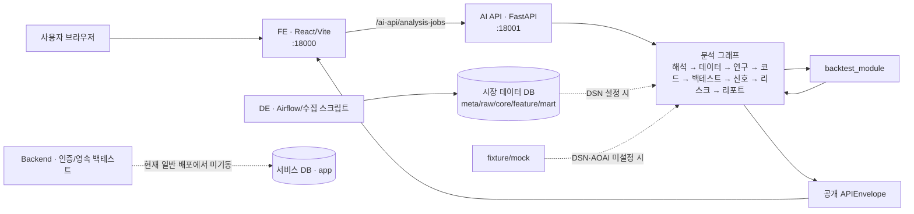
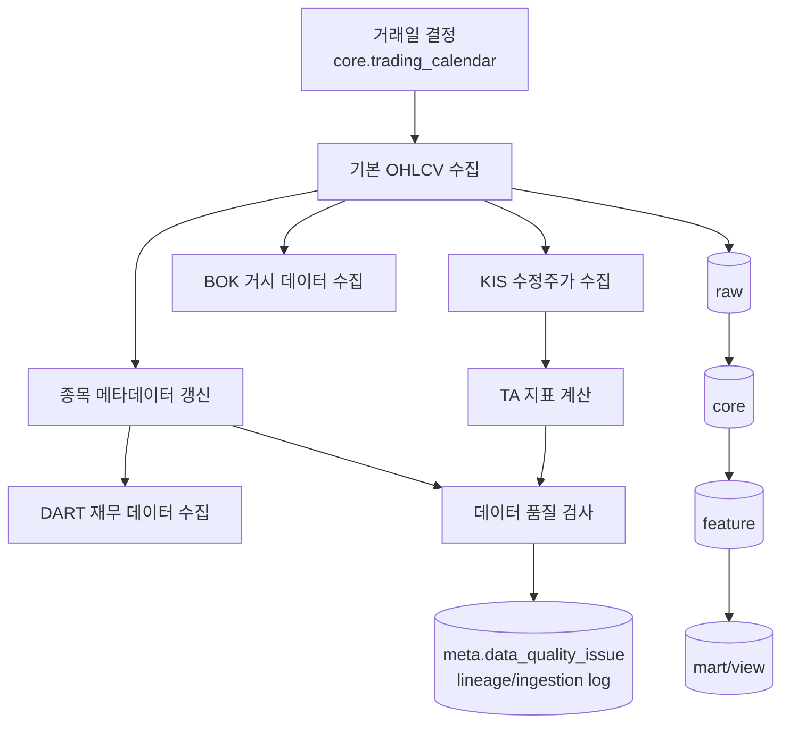
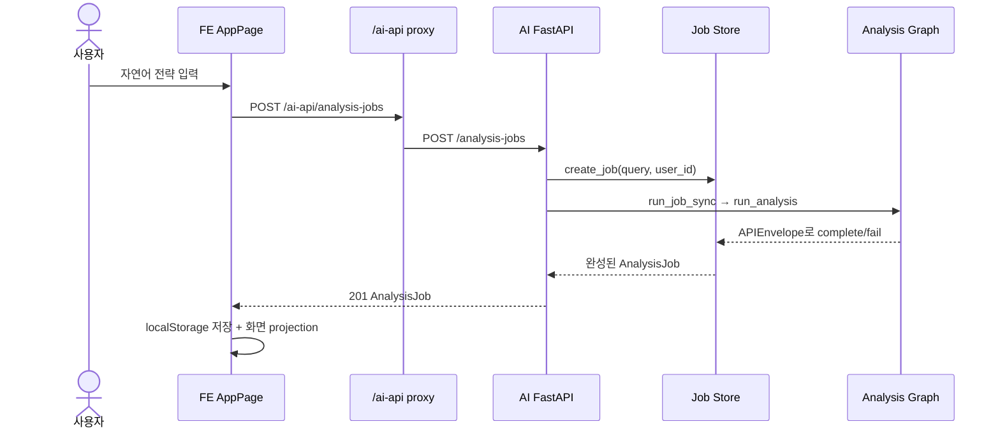
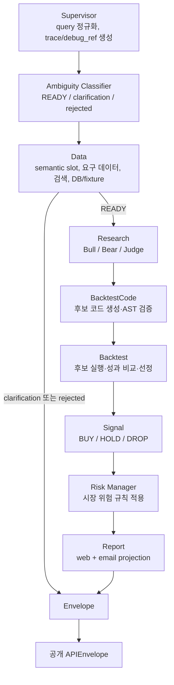
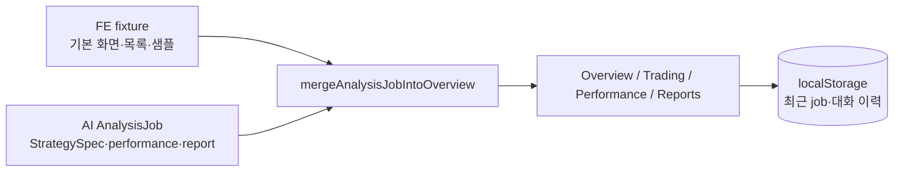
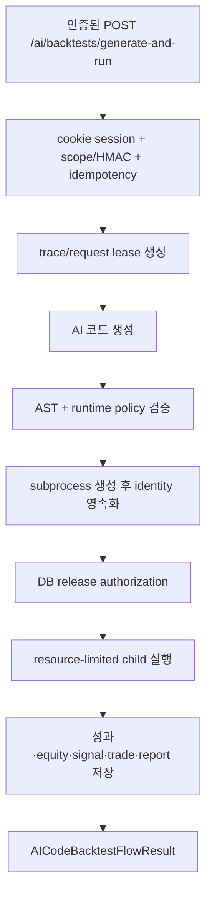
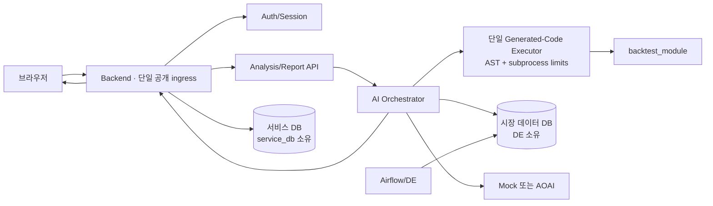
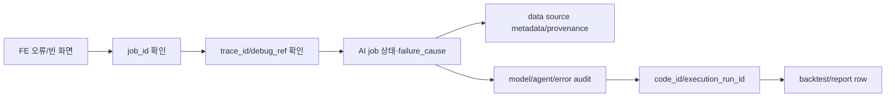

# QuantAgent 프로젝트 흐름 및 부채 해소 가이드

> 기준: 2026-07-18, `main` 브랜치, commit `a005edf`
>
> 목적: 새 팀원이 **무엇이 실제 실행되는지**, **데이터가 어디서 와서 어디로 가는지**, **왜 구조가 헷갈리는지**, **어떤 순서로 정리해야 하는지**를 한 문서에서 이해하게 한다.

## 문서의 표시 규칙

- **사실**: 저장소의 코드·설정·테스트·문서로 직접 확인한 내용
- **해석**: 여러 사실을 종합한 결론
- **제안**: 부채를 줄이기 위한 목표 상태
- **미확인**: 저장소만으로는 알 수 없고 실제 서버나 팀 결정을 확인해야 하는 내용

이 문서의 현재 구조 설명은 사실을 우선하며, 목표 구조와 정리 순서는 제안으로 구분한다.

---

## 1. 한 장으로 보는 결론

### 현재의 실질적인 MVP 실행 경로

**사실:** 현재 일반 배포 워크플로는 FE와 AI API만 설치·기동한다. 브라우저의 `/ai-api` 요청은 Vite 프록시를 거쳐 AI API의 `/analysis-jobs`로 직접 전달된다. Backend 서비스는 이 배포 경로에서 기동되지 않는다.

근거:

- FE 프록시: [`fe/vite.config.ts`](../fe/vite.config.ts#L12)
- FE가 호출하는 AI endpoint: [`fe/src/config/appConfig.ts`](../fe/src/config/appConfig.ts#L17)
- 일반 배포가 AI와 FE만 시작: [`.github/workflows/deploy.yml`](../.github/workflows/deploy.yml#L82), [`.github/workflows/deploy.yml`](../.github/workflows/deploy.yml#L139)
- 최상위 README가 정의한 MVP spine: [`README.md`](../README.md#L17)

> **재현성 경고:** 배포 workflow는 새 venv에 `ai`만 설치하지만 AI의 실제 백테스트는 `backtest_module`과 그 의존성을 요구한다. 공식 로컬 절차는 두 package를 함께 설치한다. 따라서 기존 서버에 남은 package가 없는 clean deployment에서 이 흐름이 끝까지 동작한다고 저장소만으로 보장할 수 없다. 근거: [`.github/workflows/deploy.yml`](../.github/workflows/deploy.yml#L82), [`ai/README_AI.md`](../ai/README_AI.md#L15), [`backtest_module/pyproject.toml`](../backtest_module/pyproject.toml#L10)

### 가장 중요한 네 가지 구조적 사실

1. **현재 사용자 분석 경로는 FE → AI 직결이다.** Backend는 인증, 서비스 DB, 별도 영속 백테스트 실행 기능을 갖고 있지만 일반 배포 spine에 연결되어 있지 않다.
2. **`POST /analysis-jobs`는 이름과 달리 현재 동기 실행이다.** 요청 안에서 전체 그래프를 끝까지 실행한 뒤 완성된 job을 반환한다.
3. **같은 제품 개념이 여러 구현으로 존재한다.** FE가 두 벌이고, 백테스트 패키지 소스가 두 위치에 있으며, `StrategySpec`도 목적이 다른 여러 형태로 중복 정의되어 있다.
4. **mock/fixture와 실제 데이터가 함께 존재한다.** 이 자체는 MVP에 유용하지만, 화면과 문서에서 데이터 출처가 충분히 분리되지 않으면 사용자가 결과를 실제 데이터로 오해할 수 있다.

---

## 2. 저장소 지도

| 경로 | 실제 역할 | 현재 흐름에서의 위치 | 핵심 진입점 |
| --- | --- | --- | --- |
| `fe/` | 사용자 화면, 분석 요청, 결과 projection, 브라우저 저장 | 일반 배포의 공개 UI | `src/main.tsx`, `src/App.tsx`, `src/pages/AppPage.tsx` |
| `ai/` | 자연어 분석 API, 분석 그래프, LLM·데이터 adapter, 공개 envelope | 일반 배포의 분석 서비스 | `ai_graph/api.py`, `ai_graph/graph.py` |
| `backtest_module/` | 시그널 실행, 주문 체결, 성과 계산 | AI 그래프가 호출하는 엔진 | `backtest_module/backtest_module/backtest.py` |
| `DE/` | KRX/KIS/DART/BOK/SEIBro 수집, 정규화, 지표 계산, 품질 검사 | 분석 전에 DB를 채우는 독립 파이프라인 | `airflow/dags/quant_agent_data_engineering.py` |
| `service_db/` | 사용자·전략·AI 실행·백테스트·리포트·이메일 스키마 | Backend 영속 경로의 DB 계약 | `migrations/011...016` |
| `backend/` | Google OAuth, 세션, 서비스 DB writer, 생성 코드 subprocess 실행 | 구현은 있으나 일반 배포 spine에는 없음 | `app/main.py`, `api/routes/ai_backtest.py` |
| `quantagent_strategy/` | 별도 StrategySpec와 전략 runtime 실험 | 실제 AI 경로에서 import되지 않음 | `quantagent_strategy/models.py` |
| `backend/fe-api-preview/` | FE의 별도 preview 사본 | 일반 FE와 병렬로 존재 | 별도 `package.json`, `src/` |
| `.github/workflows/` | 테스트, 일반 배포, DE 배포, 서버 health | 운영 자동화 | `code-check.yml`, `deploy.yml`, `deploy-de.yml` |

### 권장 읽기 순서

1. 이 문서
2. [`ai/README_AI.md`](../ai/README_AI.md)
3. [`DE/docs/data_engineering_runbook.md`](../DE/docs/data_engineering_runbook.md)
4. [`service_db/docs/service_db_erd.md`](../service_db/docs/service_db_erd.md)
5. [`fe/README.md`](../fe/README.md)
6. Backend 작업이 필요할 때만 [`backend/docs/google-auth-backend-implementation.md`](../backend/docs/google-auth-backend-implementation.md)와 [`backend/docs/code-review-remediation-report.md`](../backend/docs/code-review-remediation-report.md)

---

## 3. 시작부터 끝까지: 실제 MVP 분석 흐름

### 3.1 분석 전: DE가 시장 데이터를 준비한다

Airflow의 일일 DAG는 오전 4시(Asia/Seoul)에 아래 작업을 조정한다.

작업 의존성은 [`DE/airflow/dags/quant_agent_data_engineering.py`](../DE/airflow/dags/quant_agent_data_engineering.py#L118)와 같은 파일의 task chaining 부분([`L211`](../DE/airflow/dags/quant_agent_data_engineering.py#L211))에서 확인할 수 있다.

### 데이터 계층의 의미

| 계층 | 의미 | 대표 데이터 |
| --- | --- | --- |
| `meta` | 수집 실행, cursor, API 요청, 품질, lineage, 종목 universe | `ingestion_run`, `data_quality_issue`, `view_common_stock_universe` |
| `raw` | 원천 응답과 원문 근거 | OHLCV 응답, DART/BOK 응답, analyst report |
| `core` | 정규화된 기준 데이터 | 종목, 거래일, OHLCV |
| `feature` | 모델·전략이 직접 사용할 파생 데이터 | 수정주가, TA 지표, 재무·거시 feature |
| `mart` | 조회 편의를 위한 as-of view | feature frame, universe, BOK macro |
| `app` | 사용자와 서비스 실행 결과 | 전략, AI trace, 백테스트, 리포트, 이메일 |

스키마 소유권은 명확하다.

- `meta/raw/core/feature/mart`: `DE/migrations`
- `app`: `service_db/migrations`

근거: [`service_db/docs/service_db_erd.md`](../service_db/docs/service_db_erd.md#L61)

### 3.2 사용자가 FE에 진입한다

1. `fe/src/main.tsx`가 React 앱을 시작한다.
2. `fe/src/App.tsx`가 브라우저 경로를 직접 판별한다. 별도 router 라이브러리는 없다.
3. 보호 route 여부는 브라우저 `localStorage`의 `quantagent.auth.session.v1` 존재로 판단한다.
4. 개발 환경에서는 site password gate와 test login이 존재한다.

근거:

- route 분기: [`fe/src/App.tsx`](../fe/src/App.tsx#L24)
- FE 세션 저장: [`fe/src/api/authClient.ts`](../fe/src/api/authClient.ts#L5)
- 임시 test session: [`fe/src/api/authClient.ts`](../fe/src/api/authClient.ts#L66)

**중요:** FE의 route guard는 화면 표시용이다. 실제 AI API 인증이 켜져 있으면 AI는 `qa_session` cookie를 Redis에서 검증한다. `localStorage` 값만으로 API 권한이 생기지는 않는다.

근거: [`ai/ai_graph/auth.py`](../ai/ai_graph/auth.py#L15), [`ai/ai_graph/auth.py`](../ai/ai_graph/auth.py#L85)

### 3.3 사용자가 자연어 전략을 제출한다

`AppPage`는 사용자의 문장을 `createAnalysisJob(query)`에 넘긴다.

근거:

- FE submit: [`fe/src/pages/AppPage.tsx`](../fe/src/pages/AppPage.tsx#L288)
- HTTP client: [`fe/src/api/quantAgentClient.ts`](../fe/src/api/quantAgentClient.ts#L211)
- API가 동기 runner 호출: [`ai/ai_graph/api.py`](../ai/ai_graph/api.py#L381)
- job 실행: [`ai/ai_graph/jobs.py`](../ai/ai_graph/jobs.py#L298)

### “job + polling”과 실제 동작의 차이

FE에는 2초 polling과 90초짜리 client progress UI가 있다([`AppPage.tsx`](../fe/src/pages/AppPage.tsx#L29), [`AppPage.tsx`](../fe/src/pages/AppPage.tsx#L194)). 그러나 API의 POST 요청은 전체 분석이 끝난 다음 반환한다. 따라서 정상적인 현재 경로에서는 FE가 처음 받는 job이 이미 완료된 경우가 대부분이다.

또한 `run_job_sync`는 실제 각 단계가 실행될 때 progress를 갱신하는 것이 아니라, 그래프 실행 전에 모든 stage를 순서대로 `RUNNING` 처리한 뒤 한 번에 runner를 호출한다.

**해석:** 현재 progress/polling은 실제 서버 진행 상태라기보다 미래 비동기 구조를 미리 표현한 UI에 가깝다.

### 3.4 AI 그래프가 입력을 해석한다

AI 그래프는 LangGraph가 설치되어 있으면 `StateGraph`, 없으면 같은 순서를 직접 실행하는 `FallbackGraph`를 사용한다.

그래프 정의: [`ai/ai_graph/graph.py`](../ai/ai_graph/graph.py#L65), [`ai/ai_graph/graph.py`](../ai/ai_graph/graph.py#L92)

### 각 단계의 입력과 출력

| 단계 | 핵심 입력 | 핵심 출력 | 실패/분기 |
| --- | --- | --- | --- |
| Supervisor | 사용자 문장 | 정규화 query, trace, debug_ref | 빈 입력이면 실패 |
| Ambiguity | query + local KB | ambiguity 분류, 후보 3개, 질문 | READY가 아니면 무거운 분석 중단 가능 |
| Data | semantic slots | 요구 데이터, provenance, 가격, 후보, L4 evidence | DB 미설정 시 fixture |
| Research | 전략 의도 + 데이터 | bull/bear/judge debate | mock 또는 AOAI fallback |
| BacktestCode | StrategySpec | 검증된 코드 후보 | 모두 실패하면 deterministic fallback 또는 실패 |
| Backtest | 코드 + 가격/지표 | 후보별 성과, 선택 후보 | AST/실행/데이터 계약 실패 |
| Signal | 선택 백테스트 + evidence | BUY/HOLD/DROP, confidence | 누락 데이터는 confidence에 반영 |
| Risk Manager | 신호 + macro snapshot | 조정된 신호와 조정 사유 | 기본 macro 값 사용 가능 |
| Report | 전략·성과·리스크 | web/email report projection | LLM 실패 시 deterministic summary |
| Envelope | 전체 state | 공개 payload와 internal debug 분리 | 공개 응답은 내부 prompt/state 제외 |

### 3.5 Data 단계가 실제 DB와 fixture 중 하나를 선택한다

AI는 다음 순서로 DB DSN을 찾는다.

1. `AI_DATABASE_DSN`
2. `QUANT_DB_DSN`
3. `DATABASE_URL`

DSN이 있으면 PostgreSQL에서 다음 데이터를 읽는다.

| 용도 | 테이블/view |
| --- | --- |
| KIS 수정주가 | `feature.kis_adjusted_ohlcv_daily` |
| momentum/trend/volatility/volume 지표 | `feature.ta_*_ticker_daily` |
| 종목 universe | `meta.view_common_stock_universe` |
| 애널리스트 근거 | `raw.analyst_report_summary` |
| 거시 상태 | `mart.bok_macro_asof` |

근거: [`ai/ai_graph/data_sources/db.py`](../ai/ai_graph/data_sources/db.py#L17), [`ai/ai_graph/data_sources/db.py`](../ai/ai_graph/data_sources/db.py#L49), [`ai/ai_graph/data_sources/db.py`](../ai/ai_graph/data_sources/db.py#L145)

DSN이 없으면 fixture bundle을 반환한다. **DSN이 있어도 PostgreSQL 조회 중 예외가 하나라도 발생하면 같은 fixture bundle로 전환한다**([`ai/ai_graph/data_sources/db.py`](../ai/ai_graph/data_sources/db.py#L472)). 이 fallback은 로컬 재현성에는 유용하지만, 운영 장애도 성공 응답처럼 보이게 할 수 있으므로 결과 provenance를 반드시 함께 봐야 한다.

fixture bundle 자체에는 가격행이 없으므로 Backtest 단계는 최종적으로 내장된 4행 가격 fixture를 사용한다([`ai/ai_graph/nodes/backtest.py`](../ai/ai_graph/nodes/backtest.py#L45), [`ai/ai_graph/nodes/backtest.py`](../ai/ai_graph/nodes/backtest.py#L755)).

### 3.6 LLM은 mock이 기본이고 AOAI는 opt-in이다

`AI_LLM_PROVIDER`가 없거나 `mock`이면 `MockLLMClient`, `aoai`이면 role별 또는 전역 Azure OpenAI 설정을 사용한다.

역할별 호출은 주로 다음 위치에 있다.

- Research: bull / bear / judge
- Backtest code: code generation
- Signal: bull / bear / judge
- Report: bull / bear / judge
- Strategy description

근거: [`ai/ai_graph/llm/factory.py`](../ai/ai_graph/llm/factory.py#L29)

### 3.7 생성 코드를 검증하고 백테스트한다

현재 직접 AI 경로는 다음 순서를 사용한다.

1. StrategySpec에서 코드 생성 계획을 만든다.
2. LLM 또는 deterministic template로 후보 코드를 만든다.
3. AST validator로 import와 금지 동작을 검사한다.
4. 허용된 builtins만 둔 namespace에서 `exec`한다.
5. `build_signals(rows)`를 호출해 시그널을 만든다.
6. `backtest_module` 엔진으로 주문·포지션·비용·성과를 계산한다.
7. 후보별 objective score를 비교하고 최고 후보를 선택한다.

근거:

- 후보 생성: [`ai/ai_graph/nodes/backtest_code.py`](../ai/ai_graph/nodes/backtest_code.py#L80)
- 직접 실행: [`ai/ai_graph/nodes/backtest.py`](../ai/ai_graph/nodes/backtest.py#L320)
- 엔진 adapter: [`ai/ai_graph/nodes/backtest.py`](../ai/ai_graph/nodes/backtest.py#L103)

### 별도로 존재하는 Backend의 더 강한 실행 경로

Backend의 `/ai/backtests/generate-and-run` 경로는 생성·검증·실행·DB 기록을 하나의 서비스 흐름으로 묶는다. 이 경로는 임시 디렉터리, 별도 process group, resource limit, 실행 process identity 저장, release fence를 사용한다.

다만 이것은 완전한 container/network sandbox는 아니다. child가 parent 환경을 복사하고 OS subprocess/resource limit로 격리하는 수준이므로 secret 전달과 network 접근 정책은 별도로 검증해야 한다.

근거:

- route: [`backend/app/api/routes/ai_backtest.py`](../backend/app/api/routes/ai_backtest.py#L270)
- service orchestration: [`backend/app/services/ai_backtest_flow.py`](../backend/app/services/ai_backtest_flow.py#L249)
- subprocess executor: [`backend/app/services/ai_backtest_runtime.py`](../backend/app/services/ai_backtest_runtime.py#L265)
- child runner: [`backend/app/services/ai_backtest_subprocess_runner.py`](../backend/app/services/ai_backtest_subprocess_runner.py#L35)

**해석:** 동일한 “생성 코드 백테스트”에 대해 직접 AI의 in-process 실행과 Backend의 fenced subprocess 실행이라는 두 보안·영속성 모델이 병존한다.

### 3.8 Signal, Risk, Report가 사용자 결과를 만든다

Signal은 선택된 후보의 Sharpe와 drawdown, L4 evidence, bull/bear/judge 결과를 이용해 `BUY`, `HOLD`, `DROP`을 결정한다. 누락된 생산 adapter도 bear case와 confidence에 반영한다.

Risk Manager는 현재 세 가지 명시적 규칙을 적용한다.

| 조건 | 조정 |
| --- | --- |
| KOSPI 종가 변화율 ≤ -5% | BUY → HOLD |
| 환율 일변화 절대값 > 2% | BUY confidence ≤ 0.7 |
| VKOSPI > 30 | BUY confidence ≤ 0.6 |

근거: [`ai/ai_graph/nodes/signal.py`](../ai/ai_graph/nodes/signal.py#L210), [`ai/ai_graph/nodes/risk_manager.py`](../ai/ai_graph/nodes/risk_manager.py#L16)

Report는 같은 결과로 두 projection을 만든다.

- `web_projection`: FE 상세 화면용
- `email_projection`: 이메일 요약용

근거: [`ai/ai_graph/nodes/report.py`](../ai/ai_graph/nodes/report.py#L9)

### 3.9 APIEnvelope가 내부 정보와 공개 정보를 분리한다

최종 응답은 `APIEnvelope`로 고정된다. 대표 상태는 다음과 같다.

- `ready`
- `need_clarification`
- `rejected`
- `failed`

공개 payload에는 사용자 결과, StrategySpec, trace/debug reference, retry 가능 여부가 포함된다. node 전체 state, raw prompt, 내부 검증 trace는 공개 payload에서 제외한다.

근거: [`ai/ai_graph/schemas.py`](../ai/ai_graph/schemas.py#L192), [`ai/README_AI.md`](../ai/README_AI.md#L174)

### 3.10 FE가 결과를 화면 모델로 변환한다

FE는 AI 응답을 그대로 그리지 않는다. `quantAgentClient.ts`가 fixture 기반 화면 모델 위에 AI 결과를 overlay한다.

브라우저에 저장되는 주요 상태:

| key | 의미 |
| --- | --- |
| `quantagent.auth.session.v1` | FE가 보는 로그인 상태 |
| `quantagent.latest-analysis-job.v1` | 마지막 AI job |
| `quantagent.chat-conversations.v1` | 최대 8개 대화와 job 배열 |
| `quantagent.notification-settings.v1` | 로컬 알림 설정 |
| `quantagent.email-digest-strategies.v1` | 로컬 이메일 전략 선택 |

근거: [`fe/src/api/quantAgentClient.ts`](../fe/src/api/quantAgentClient.ts#L189), [`fe/src/pages/AppPage.tsx`](../fe/src/pages/AppPage.tsx#L27), [`fe/src/api/preferencesClient.ts`](../fe/src/api/preferencesClient.ts#L3), [`fe/src/api/emailDigestClient.ts`](../fe/src/api/emailDigestClient.ts#L1)

---

## 4. 별도 Backend 경로는 무엇을 하는가

Backend는 단순 proxy가 아니라 다음 책임을 가진 별도 FastAPI 앱이다.

Backend의 주요 책임:

- Google OAuth와 Redis 기반 세션
- CSRF/origin/cookie 정책
- `app.*` 서비스 DB 접근
- 생성 코드 실행의 idempotency와 lease
- subprocess ownership과 release fence
- 백테스트 결과·AI trace·model/prompt/agent/error log 저장
- PDF 임시 수집과 FE contract mock adapter

### 주의: Backend의 `/analysis-jobs`는 실제 AI 그래프가 아니다

Backend에도 `/analysis-jobs`, `/api-status`, `/api/reports/...`가 있지만, 이들은 `backend/app/data/fe_mock_contract.json`과 in-memory store를 사용하는 FE contract adapter다.

근거: [`backend/app/api/routes/fe_contract.py`](../backend/app/api/routes/fe_contract.py#L147), [`backend/app/api/routes/fe_contract.py`](../backend/app/api/routes/fe_contract.py#L188)

**해석:** URL 모양만 보면 AI API와 Backend API를 구분하기 어렵다. 서비스별 base URL을 잘못 설정해도 “형식상 정상인 mock 응답”을 받을 수 있어 진단이 늦어질 수 있다.

---

## 5. 런타임 모드와 상태 저장 위치

### 5.1 기본값과 opt-in

| 관심사 | 기본/현재 코드 동작 | 실제 기능 opt-in |
| --- | --- | --- |
| LLM | `mock` | `AI_LLM_PROVIDER=aoai` + AOAI 설정 |
| 시장 데이터 | fixture | DB DSN 설정 |
| AI job store | memory | `AI_JOB_STORE=persistent` + repository adapter |
| AI audit sink | noop | 승인된 Postgres Gate B 설정 |
| AI auth | enabled, fail-closed | 로컬만 `AUTH_ENABLED=0`; 운영은 Redis 필요 |
| graph runtime | LangGraph가 없으면 `FallbackGraph` | LangGraph 설치 시 StateGraph |
| Backend DB | `DATABASE_URL` 필수 | 별도 fallback 없음 |
| Backend Redis | auth 기능에 필요 | `REDIS_URL` |

### 기본값을 이해할 때의 함정

- AI package dependency에는 `langgraph`가 없다. 표준 설치에서는 순차 `FallbackGraph`가 실행될 가능성이 높다.
- AI 인증은 기본 활성화지만, 일반 배포 workflow에는 `AUTH_ENABLED`, `REDIS_URL`을 명시하지 않는다.
- 실제 서버 shell 환경에 값이 주입되어 있을 수 있으므로 배포 성공 여부는 저장소만으로 확정할 수 없다.

### 5.2 상태의 실제 위치

| 상태 | 위치 | 수명 |
| --- | --- | --- |
| FE 로그인 표시 | browser localStorage | 브라우저별 |
| FE 최근 job/대화 | browser localStorage | 브라우저별 |
| AI job 기본 | Python process memory | 재시작 시 소실 |
| AI debug store 기본 | Python process memory | 재시작 시 소실 |
| Google session | Redis | TTL/로그아웃까지 |
| 시장·feature 데이터 | PostgreSQL `meta/raw/core/feature/mart` | migration/retention 정책 |
| 사용자·실행·리포트 | PostgreSQL `app` | service DB 정책 |
| Backend child input/output | 임시 디렉터리 | 실행 종료 시 삭제 |

---

## 6. 인지부채 진단

인지부채는 “코드가 틀렸다”가 아니라 “올바른 정신 모델을 만드는 데 불필요한 추론이 많이 든다”는 뜻이다.

| 우선순위 | 인지부채 | 확인된 근거 | 생기는 혼란 | 해소 원칙 |
| --- | --- | --- | --- | --- |
| C0 | 공개 실행 경로가 두 이야기로 존재 | 배포는 FE+AI, Backend는 별도 구현 | 어느 API가 production 진실인지 불명확 | 공개 ingress와 canonical flow를 하나로 결정 |
| C0 | job/polling 이름과 동기 동작 불일치 | POST 안에서 `run_job_sync` | progress가 실제인지 UI 연출인지 불명확 | sync면 sync로 단순화; 필요 시에만 진짜 async 전환 |
| C0 | 화면 데이터가 fixture와 AI 결과의 합성 | FE hybrid projection | 어떤 숫자가 실제 분석 결과인지 판단 어려움 | field-level provenance 표시 또는 fixture 제거 |
| C1 | 동일 URL 계약의 mock Backend adapter | Backend `/analysis-jobs`, `/api-status` | 잘못된 base URL도 정상처럼 보일 수 있음 | mock namespace 분리 또는 preview 전용 앱으로 격리 |
| C1 | StrategySpec가 여러 의미로 중복 | AI, engine, `quantagent_strategy`, signal에 각각 정의 | “canonical”이라는 이름이 실제 의존성과 다름 | 용도별 이름 + 단일 adapter + 미사용 패키지 제거 |
| C1 | FE가 두 벌 | `fe/`, `backend/fe-api-preview/` | 어떤 화면을 수정해야 하는지 불명확 | 단일 FE만 유지, preview는 build artifact로 대체 |
| C1 | graph라는 이름과 fallback 순차 runtime | `langgraph`는 optional/undeclared | 상태 그래프 기능을 실제로 쓰는지 불명확 | 현재 순차 orchestration을 사실대로 문서화 |
| C2 | 대형 파일이 많은 책임을 흡수 | `graph.py` 2,113줄, repository 1,660줄 등 | 변경 영향 범위를 읽기 어렵고 리뷰 비용 증가 | 추상화 추가가 아니라 안정된 경계 기준으로 파일만 분리 |
| C2 | 생성 산출물·pycache가 추적됨 | 31,567줄 report, `.pyc` 3개 | 검색 결과와 코드량 통계 왜곡 | 생성물은 CI artifact로 이동하고 Git에서 제거 |

### StrategySpec 중복을 정확히 이해하는 법

현재 “하나로 합치면 된다”보다 먼저 역할을 분리해야 한다.

- `ai/ai_graph/schemas.py::StrategySpec`: 사용자에게 공개되는 분석 계약
- `backtest_module/.../models.py::StrategySpec`: 백테스트 실행 설정이 풍부한 엔진 계약
- `quantagent_strategy/.../models.py::StrategySpec`: 독립 실험 패키지의 계약; 실제 AI 흐름에서 미사용
- `ai_graph/nodes/signal.py`의 signal models: 단일 시점 신호 계산용 로컬 계약

**제안:** 공개 계약과 엔진 계약은 억지로 하나로 합치지 않는다. 이름을 명확히 하고 `ai_graph/nodes/backtest.py`의 adapter를 유일한 변환 경계로 둔다. 실제 consumer가 없는 `quantagent_strategy`는 보존 이유를 확인한 뒤 삭제하는 편이 새 공통 추상화를 만드는 것보다 작다.

---

## 7. 기술부채 진단

### P0 — 운영·보안·정합성에 직접 영향

| 항목 | 사실 | 위험 | 완료 조건 |
| --- | --- | --- | --- |
| 배포가 개발 서버를 사용 | AI `uvicorn --reload`, FE `npm run dev`; 앞에서 만든 production build는 기동에 사용하지 않음 | reload/dev server의 운영 불확실성, 불필요한 파일 감시 | production process 명령과 정적 FE 서빙을 사용하고 health check가 그 경로를 검증 |
| 배포가 테스트 성공에 의존하지 않음 | `code-check.yml`과 `deploy.yml`은 서로 독립된 main-push workflow | CI 실패와 배포 성공이 동시에 가능 | 검증 성공 artifact/revision만 배포 |
| Node 버전 불일치 | CI/README는 24.15.0, 배포 setup은 20 | 재현성 저하, 로컬·CI·서버 차이 | 하나의 버전을 모든 문서·CI·배포에 고정 |
| clean venv의 백테스트 의존성 누락 | 배포는 `ai`만 설치하지만 공식 로컬 절차는 `backtest_module`과 `ai`를 함께 설치 | 기존 서버 잔여 패키지가 없으면 분석 중 import 실패 가능 | 배포도 두 package를 명시적으로 설치하고 clean-vm smoke 실행 |
| Backend 기능이 일반 배포에 없음 | 인증·서비스 DB·fenced executor 구현은 있으나 프로세스 미기동 | 기능이 존재하지만 사용자는 접근하지 못함 | Backend를 canonical ingress로 배포하거나, 의도적으로 MVP 밖임을 코드/route에서 제거 |
| 생성 코드 실행 모델 이중화 | AI는 in-process `exec`, Backend는 fenced subprocess | 같은 기능의 보안 수준이 경로마다 다름 | 하나의 executor만 남기고 모든 생성 코드가 그 경계를 통과 |
| 인증 상태 이중화 | FE localStorage guard, 서버 cookie/Redis auth | 화면은 로그인인데 API는 401이거나 반대인 상태 | 앱 시작 시 `/auth/me`를 canonical session source로 사용 |
| 배포 종료가 포트만 신뢰 | 18000/18001 listener PID에 소유권 확인 없이 TERM/KILL | 같은 포트를 쓰는 다른 process 종료 가능 | 저장한 PID·시작시각·실행파일·argv를 검증한 뒤 소유 process만 종료 |

배포 근거: [`.github/workflows/deploy.yml`](../.github/workflows/deploy.yml#L21), [`.github/workflows/deploy.yml`](../.github/workflows/deploy.yml#L139)

### P1 — 변경 비용·회귀 위험에 영향

| 항목 | 사실 | 위험 | 완료 조건 |
| --- | --- | --- | --- |
| 백테스트 소스가 두 위치에서 갈라짐 | `backtest_module/backtest.py`와 `backtest_module/backtest_module/backtest.py`가 서로 다름 | import context에 따라 다른 엔진 가능 | src-layout 또는 단일 package tree로 정리, import-path test 추가 |
| FE 사본이 이미 drift | 동일 파일도 있고 서로 다른 파일도 다수 | 수정 누락, bug 재발 | preview 사본 제거; 한 FE build만 사용 |
| 영속 migration의 전역 history 부재 | service DB 문서가 수동 baseline과 경로 기반 식별을 요구 | 재적용/순서 오류 | DE+service DB를 아우르는 단일 migration ledger와 검증 명령 |
| job store가 기본 memory | 재시작 시 job/result 소실 | 복원·감사·다중 process 불가 | 운영에서는 persistent를 fail-closed로 요구하거나 sync 결과만 명확히 사용 |
| persistent adapter의 실제 조립점이 없음 | adapter는 있지만 module-level AI app은 repository/factory를 주입하지 않음 | `AI_JOB_STORE=persistent` 요청이 memory fallback으로 남음 | 운영 app factory에서 adapter를 명시적으로 조립하고 startup에 active mode 검증 |
| 호환 endpoint의 인증/소유권 누락 | AI daily digest와 Backend FE contract 쓰기 route 일부에 사용자 dependency가 없음 | Backend 노출 시 사용자 격리·CSRF 계약 불일치 | dev-only router 격리 또는 canonical auth dependency 적용 |
| CI가 전체 suite를 실행하지 않음 | backend 일부 smoke, AI 일부 contract만 일반 workflow에서 실행 | 통과하지 않은 영역의 회귀가 main에 유입 | 변경 경로별 전체 lint/test matrix 또는 최소한 full unit suites |
| FE 자동 테스트 부재 | `npm test`는 typecheck+build이고 `src`에 test 없음 | interaction/polling/provenance 회귀 | 핵심 submit→ready/clarification/error 3개만 자동화 |
| LangGraph dependency/의도 불명확 | import fallback은 있으나 package dependency 없음 | 개발자마다 runtime 차이 | 순차 runtime을 공식화하거나 dependency를 명시하고 graph test 고정 |
| readiness가 핵심 기능을 검사하지 않음 | deploy는 AI `/health`와 FE `/`만 확인 | DB·Redis·auth·backtest가 깨져도 green | protected analysis smoke와 dependency 상태를 별도 readiness로 검증 |

### P2 — 저장소 위생·탐색 비용

| 항목 | 사실 | 조치 |
| --- | --- | --- |
| 생성 artifact가 저장소를 지배 | `node_results.json` 약 72MB·2,083,379줄, `report.md` 31,567줄 | golden input만 남기고 결과는 CI artifact로 업로드 |
| `.pyc` 3개 추적 | `quantagent_strategy/.../__pycache__` | Git에서 제거; `.gitignore`는 이미 준비됨 |
| 파일 크기 집중 | graph/repository/flow/client가 800~2,100줄 | 새 framework 없이 안정된 책임 경계로만 분할 |
| DE dependency 선언 모순 | `numpy==1.26.4`와 unpinned `numpy`가 같은 requirements에 존재 | 중복 줄 제거, 재현 가능한 단일 선언 유지 |
| DE 문서와 DAG drift | README에는 일일 SEIBro task가 있으나 실제 DAG에는 없음 | 문서를 실제 DAG에 맞추거나 task를 구현한 뒤 같은 test로 고정 |
| 배포 workflow 중복 | DE 변경이 일반 배포와 DE 배포를 모두 실행하며 concurrency group도 공유 | 서비스별 변경 경로와 배포 책임을 분리 |

---

## 8. 부채를 줄인 목표 구조

### 목표: 공개 경로 하나, 실행 경계 하나, 계약별 소유자 하나

### 목표 구조의 결정 사항

| 주제 | 제안 | 이유 |
| --- | --- | --- |
| 공개 ingress | Backend 하나 | auth, cookie, CSRF, 서비스 DB, API base URL을 한 경계로 모음 |
| AI API | 내부 서비스 또는 Backend 호출 library | 사용자에게 두 API surface를 노출하지 않음 |
| 생성 코드 | Backend의 fenced subprocess 원칙을 유일한 실행 경계로 재사용 | 이미 있는 강한 경계를 버리지 않음 |
| job 모델 | 먼저 sync를 정직하게 표현 | queue/worker는 p95 시간이나 동시성 요구가 생길 때만 추가 |
| StrategySpec | 공개 spec과 engine spec을 구분, adapter 하나 | 서로 다른 책임을 억지로 합치지 않음 |
| FE | `fe/` 하나 | preview 복제 대신 동일 build에 mock mode를 둠 |
| provenance | 모든 결과 section에 `source: fixture | postgres | aoai | deterministic` | 혼합 결과 오해 방지 |
| migration | 한 ledger에서 DE/app 적용 이력 기록 | schema owner는 유지하되 적용 상태는 통합 |

### 당장 추가하지 않을 것

- 별도 microservice 추가
- 새 queue/worker dependency
- 새 schema registry 제품
- 새로운 frontend framework/router
- 새 abstraction 계층

이들은 현재 부채의 원인이 아니다. 먼저 중복을 지우고 실제 경로를 하나로 만드는 것이 더 작고 효과가 크다.

---

## 9. 실행 순서가 있는 해소 로드맵

### Phase 0 — 진실을 하나로 고정

목표: 팀이 같은 시스템을 말하게 한다.

- [ ] “일반 배포의 공개 ingress는 Backend다 / AI 직결이다” 중 하나를 ADR로 결정
- [ ] 실제 서버의 process, reverse proxy, env injection, 공개 URL을 read-only로 확인
- [ ] `/health`뿐 아니라 인증된 `/analysis-jobs` smoke를 추가
- [ ] mock/fixture/live 결과를 응답과 화면에서 구분
- [ ] sync job을 공식화하고 fake progress를 제거하거나, 실제 async 전환을 별도 계획으로 분리

완료 조건: 한 장짜리 배포 다이어그램과 실제 process/URL이 일치한다.

### Phase 1 — 중복을 삭제

목표: 같은 역할을 수정할 파일이 하나만 남게 한다.

- [ ] `backend/fe-api-preview`의 실제 consumer 확인 후 제거
- [ ] 백테스트 import path를 하나로 고정하고 중복 root module 제거
- [ ] `quantagent_strategy` consumer가 없음을 검증한 뒤 보관/삭제 결정
- [ ] tracked `.pyc`와 생성 report 제거
- [ ] mock contract endpoint는 `/dev` namespace 또는 test app으로 격리

완료 조건: FE, 백테스트 엔진, 분석 endpoint 각각 canonical 경로가 하나다.

### Phase 2 — 실행 경계를 통합

목표: 어느 route로 실행해도 같은 안전·정합성 규칙을 적용한다.

- [ ] 생성 코드 실행을 fenced subprocess 하나로 통합
- [ ] AST validator 중복을 하나로 통합
- [ ] 공개 spec → engine spec adapter를 단일 함수와 contract test로 고정
- [ ] auth source를 `/auth/me` + HttpOnly cookie로 통일
- [ ] Backend/AI 사이 trace_id, user_id, strategy_id 전달 계약 고정

완료 조건: 생성 코드를 in-process `exec`하는 공개 경로가 없다.

### Phase 3 — 영속성과 운영 계약을 고정

목표: 재시작과 배포 뒤에도 실행을 설명할 수 있게 한다.

- [ ] 운영 job store를 persistent 또는 명시적 sync response로 고정
- [ ] DE와 service DB migration ledger 통합
- [ ] production command에서 `--reload`와 Vite dev server 제거
- [ ] Python/Node 버전을 README·CI·배포에서 통일
- [ ] 운영 audit sink 활성화 조건을 실제 환경에서 검증

완료 조건: 배포 후 trace 하나로 request → model → code → execution → report를 조회할 수 있다.

### Phase 4 — 최소 회귀 방지

목표: 복잡한 suite가 아니라 핵심 흐름이 깨지면 바로 알게 한다.

- [ ] FE: ready / clarification / error 3개 흐름
- [ ] API: auth-on + persistent + DB fixture 통합 smoke
- [ ] Executor: 금지 import, timeout, memory, 정상 실행 4개
- [ ] Contract: public StrategySpec → engine spec → result projection 1개 e2e
- [ ] Deployment: production process와 protected endpoint health

완료 조건: 위 다섯 종류의 check가 main merge 전에 자동 실행된다.

---

## 10. 변경할 때 어디를 봐야 하는가

| 변경 목적 | 먼저 볼 파일 | 같이 확인할 계약 |
| --- | --- | --- |
| 사용자 입력/화면 | `fe/src/pages/AppPage.tsx` | `types/quantagent.ts`, `quantAgentClient.ts` |
| API endpoint | `ai/ai_graph/api.py` | `jobs.py`, FE client, contract tests |
| 자연어 해석 | `ai/ai_graph/graph.py` | retrieval corpus, StrategySpec |
| DB 조회 | `ai/ai_graph/data_sources/db.py` | DE migration/view, data availability |
| 코드 생성 | `ai/ai_graph/nodes/backtest_code.py` | AST validator, LLM prompt/schema |
| 백테스트 | `ai/ai_graph/nodes/backtest.py` | `backtest_module`, spec adapter |
| 신호/리스크 | `nodes/signal.py`, `nodes/risk_manager.py` | macro source와 fallback |
| 리포트 | `nodes/report.py` | FE report projection, service DB report schema |
| 인증 | `backend/app/api/routes/auth.py` | AI `auth.py`, Redis key/cookie 이름 |
| 영속 AI backtest | `backend/app/services/ai_backtest_flow.py` | repository, migrations 011/015/016 |
| 시장 데이터 | `DE/airflow/dags/...` | source client, repository, quality test |
| DB schema | `DE/migrations`, `service_db/migrations` | 실제 적용 ledger와 replay test |

### trace 기반 장애 추적 순서

진단 원칙:

1. 화면 fixture 문제인지 AI result 문제인지 먼저 분리한다.
2. `job_id`보다 `trace_id`를 서비스 간 공통 키로 사용한다.
3. DB fallback, mock LLM, noop audit 여부를 먼저 확인한다.
4. generated code 내용보다 validation/execution status를 먼저 본다.
5. 실제 서버 문제는 `/health`만으로 정상 판정하지 않는다.

---

## 11. 검증 명령의 기준

기존 상세 실행 절차는 각 하위 README를 따른다. 새 umbrella script나 dependency는 만들지 않는다.

### 변경 영역별 최소 검증

| 영역 | 최소 검증 |
| --- | --- |
| FE | `npm --prefix fe run test` + 핵심 화면 smoke |
| AI | `pytest`의 graph/API/contract 대상 + `ruff` |
| Backtest | `pytest backtest_module/tests` |
| Backend | `pytest backend/tests/unit` 중 변경 서비스 전체 |
| DE | 해당 source/ingestion/quality test + DAG import |
| Migration | static SQL test + disposable DB replay |
| 배포 | 실제 production process 확인 + 보호 endpoint smoke |

**사실:** 현재 일반 CI는 이 전체 표를 모두 실행하지 않는다. 특히 FE의 `test` script는 typecheck와 build이며 interaction test가 없다([`fe/package.json`](../fe/package.json#L7)).

---

## 12. 저장소만으로 확정할 수 없는 것

다음은 실제 서버 또는 팀 결정 확인이 필요하다.

1. 일반 서버에서 `AUTH_ENABLED`, `REDIS_URL`, DB DSN, AOAI 설정이 어떤 방식으로 export되는가
2. 외부 reverse proxy가 FE·AI·Backend 경로를 어떻게 나누는가
3. Backend가 workflow 밖에서 별도 process manager로 기동되는가
4. 공용 DB의 실제 migration ledger와 저장소 migration이 완전히 일치하는가
5. `backend/fe-api-preview`와 `quantagent_strategy`에 저장소 밖 consumer가 있는가
6. 운영에서 AI job 결과와 audit raw logging을 어느 기간 보존해야 하는가

이 항목들은 코드 변경 전에 read-only 운영 확인으로 닫아야 한다.

---

## 13. 최종 정신 모델

현재 QuantAgent는 하나의 완성된 monolith라기보다 다음 세 축이 한 저장소에 모인 상태다.

1. **실제로 배포되는 MVP:** FE → AI → backtest → FE
2. **시장 데이터 공급망:** DE → 시장 데이터 DB → AI
3. **운영형 서비스 후보:** Backend → auth/service DB/fenced execution

인지부채를 줄이는 핵심은 문서를 더 많이 만드는 것이 아니라 **이 세 축 중 공개 실행 경로를 하나로 결정하고 중복 구현을 지우는 것**이다. 기술부채를 줄이는 핵심은 **생성 코드 실행, 인증, job 상태, 데이터 provenance를 경로마다 다르게 두지 않는 것**이다.

가장 작은 올바른 순서는 다음과 같다.

> 실제 배포 확인 → canonical ingress 결정 → 중복 삭제 → executor/auth 통합 → 영속성 → 최소 e2e
