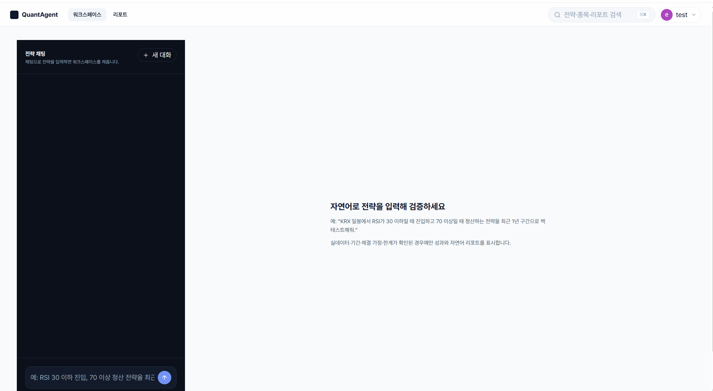
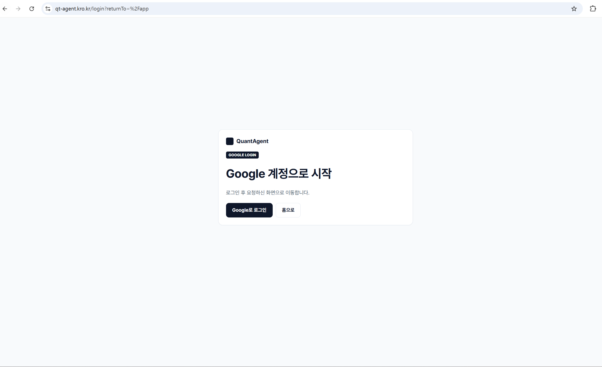

# UX-AUTH-03 Execution Evidence

## 검증 대상

- WBS ID: `UX-AUTH-03`
- 작업 원문: `테스트 세션으로 login, refresh, logout을 검사한다.`
- Done · QA 계약: `user-provided test session provenance와 trace PASS`
- WBS 지정 실행검증(원문): `cd fe && npm test`
- 이 문서의 성격: **소유자 실행(owner execution) evidence다. 독립 QA 승인 evidence가 아니며, 이 문서 자체로 최종 승인을 대신하지 않는다.**
- repo: `Quant_agent`(canonical, public)
- application tested SHA: `9de51544d377cb3f94372a43d5e9763be21342f7`
- execution branch HEAD: `91730721c1bcf2b17ced0ca9cda30ece5a874359`(`fe/**` application source는 application tested SHA와 동일)
- 대상 public URL: `https://qt-agent.kro.kr`

## 검증 환경 및 범위

- OS: Windows
- 인증 방식: 사용자가 직접 준비한 test-account로 실제 Google OAuth 로그인을 수행. credential(비밀번호, 2FA 등)은 사용자가 브라우저 UI에 직접 입력했으며, Claude에게 제공되거나 조회된 적이 없다.
- 원래 계획은 Playwright headed Chromium을 직접 실행해 정식 `.zip` trace를 생성하는 것이었으나, 실행 환경의 프로세스 스폰 제한(`spawn UNKNOWN` / permission denied, sandbox 해제 옵션 적용 후에도 동일)으로 불가능했다. 이는 애플리케이션/소스 코드의 결함이 아니라 이번 실행 환경의 제약이다.
- 대신 Claude Code Browser 패널(실제로 화면에 렌더링되는 브라우저)을 사용해 동일한 시나리오를 수행했다.
- application source·test 코드는 이 실행 과정에서 전혀 수정하지 않았다.

## WBS 지정 실행검증

```text
cd fe && npm test
```

- exit code: `1`
- tests: `68`, passed: `62`, failed: `6`, skipped: `0`
- `.test.mts` 단계에서 실패가 발생해 `&&` 체인이 `typecheck`/`build` 단계까지 도달하지 못했다.
- 실패 6건은 UX-AUTH-03의 인증 lifecycle(login/refresh/logout)과 직접 관련된 테스트가 아니다. 원인은 Windows에서 `file://` pathname을 처리하는 과정에서 drive 경로가 중복 결합되는 기존 경로 호환성 문제로 확인됐다(테스트 스크립트가 `new URL(...).pathname`으로 config 경로를 만드는 패턴).
- **WBS 공식 npm verifier 판정: `FAIL (environment/path compatibility observation)`** — 이 결과는 아래 "실제 인증 세션 실행" 결과와 별개의 FE regression observation으로만 취급하며, 서로 대체하거나 혼동하지 않는다.

## 실제 인증 세션 실행

1. 보호 route `/app` 접근
2. 로그인 화면 `https://qt-agent.kro.kr/login?returnTo=%2Fapp`로 이동, `returnTo=%2Fapp` 보존 확인
3. 실제 Google OAuth 로그인(사용자가 브라우저에서 직접 수행)
4. 로그인 후 authenticated `/app` workspace 진입 확인
5. 페이지 refresh(reload) 수행
6. 재로그인이나 session loss 없이 authenticated `/app` 상태 유지 확인
7. 실제 UI의 로그아웃 동작 수행
8. 홈(`/`)으로 이동 확인
9. 동일 보호 route(`/app`)에 재접근
10. signed-out 상태에서 로그인 화면(`https://qt-agent.kro.kr/login?returnTo=%2Fapp`)으로 정상 차단됨을 확인, `returnTo=%2Fapp` 보존 확인

이 과정에서 Claude는 password, cookie, session/access/refresh token, Authorization header, OAuth code/state 값을 요청·조회·출력한 적이 없다. 확인한 것은 URL과 accessibility-tree상의 버튼/링크 라벨뿐이다.

## Login / Refresh / Logout 결과

| 항목 | 판정 | 근거 |
|---|---|---|
| login | `PASS` | 실제 Google OAuth 인증 후 authenticated `/app` workspace 진입 |
| refresh | `PASS` | reload 후 재로그인 없이 authenticated `/app` 상태 유지 |
| logout | `PASS` | logout 후 `/app` 재접근 시 로그인 화면으로 차단되고 `returnTo=%2Fapp` 보존 |

**기능 실행 결과: `PASS`**

### Screenshot evidence


로그인 성공 후 authenticated `/app` workspace가 렌더링된 상태.


페이지 refresh(reload) 이후에도 재로그인 없이 authenticated `/app` 상태가 유지된 상태.


logout 후 `/app`에 재접근 시 `qt-agent.kro.kr/login?returnTo=%2Fapp`로 차단되며 로그인 화면이 표시된 상태.

## Trace 및 provenance

- 정식 Playwright `.zip` trace artifact: **여전히 `PENDING`.** 환경 제약(위 "검증 환경 및 범위" 참조)으로 표준 trace 파일은 생성되지 않았다.
- 사용자가 별도로 직접 캡처하여 로컬 파일로 보존한 **durable screenshot artifact 3개**가 존재하며, 이번 문서에 `assets/`로 함께 배치했다:
  1. `assets/01-login-authenticated.png` — login 성공 후 authenticated `/app` workspace 화면
  2. `assets/02-refresh-session-retained.png` — refresh 후 authenticated 상태 유지 화면
  3. `assets/03-logout-protected-route-blocked.png` — logout 후 `/app` 재접근 시 로그인 화면(`qt-agent.kro.kr/login?returnTo=%2Fapp`)으로 차단된 화면
- 1·2번 화면에는 테스트 전용 계정의 일반 표시명만 노출되며 이메일·실명·전화번호·token 등의 식별정보는 노출되지 않는다. 3번 화면은 비인증 상태라 계정 식별정보 자체가 렌더링되지 않는다. 세 화면 모두 public-safe artifact로 취급한다.
- 이 스크린샷들은 login→refresh→logout lifecycle 실행 결과를 뒷받침하는 **보조 durable evidence**다. **정식 Playwright trace를 대체한다고 주장하지 않는다.**
- **정식 trace artifact: `PENDING`**(screenshot 3개는 보조 evidence로 존재하지만 이를 대체하지 않는다)

## 반증 및 미검증 범위

- 실패·예외 없이 login/refresh/logout 3개 시나리오 모두 실제 공개 배포 인스턴스에서 순서대로 확인됐다.
- `?tab=security` query가 로그인 왕복 과정에서 보존됐다는 주장은 하지 않는다 — 실제 확인된 것은 `/app`(query 없음) 기준의 `returnTo=%2Fapp` 보존과 authenticated 진입뿐이다.
- `npm test`의 6건 실패는 위에서 기록한 대로 별도 관찰 사항이며, 이번 인증 세션 검증 결과를 무효화하지 않는다.
- 정식 Playwright trace(.zip)는 여전히 없다. durable screenshot 3개가 보조 evidence로 이 문서에 배치됐으나, 정식 trace를 대체하지 않는다.
- 이번 실행 환경(현재 Bash 샌드박스)에서 headed Chromium을 직접 스폰하는 방식은 재현 불가하다는 점도 향후 재실행 시 참고가 필요하다.

## 소유자 실행 결과

- 기능 실행 결과: `PASS`
- login: `PASS`
- refresh: `PASS`
- logout: `PASS`
- 정식 trace artifact: `PENDING`(보조 durable screenshot 3개 존재)
- WBS 공식 npm verifier: `FAIL (environment/path compatibility observation)`
- WBS Done 전체 충족 여부: **완전 충족이라고 단정하지 않음**

**추천 상태 표현: `증적대기 — functional lifecycle PASS, formal trace pending`**

## 검토 기록

- 이 문서는 **WBS 소유자 실행 evidence**이며, **독립 QA 승인(APPROVE) evidence가 아니다.**
- `APPROVE`, `reviewer approved`, `QA approved`, `최종 승인 완료` 등 승인을 의미하는 문구는 이 문서에 기록하지 않는다.
- 최종 승인 여부는 WBS가 지정한 별도 승인자의 판단에 맡긴다.
- 실행/증적 작성: WBS 소유자 실행 지원 (AI-assisted, Claude Code)
- 검토일: `2026-08-27 (KST)`
