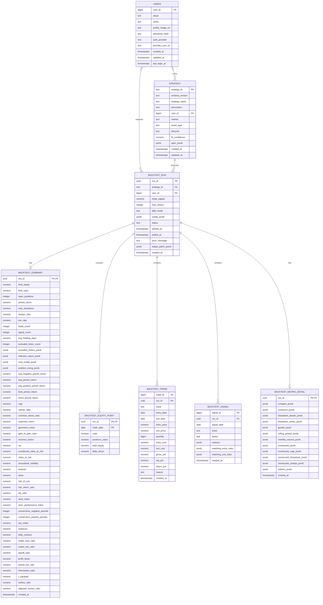

# Service DB Backtest ERD

`001_app_schema.sql`과 `002_extend_backtest_results.sql`을 모두 적용한 후의 백테스트 저장 구조를 표현한다.

## `backtest_metric_detail` 저장 방식

`backtest_metric_detail`은 `backtest_run`과 1:0..1 관계이며, 상세 지표를 명시적 JSONB 컬럼으로 저장한다.

| 컬럼 | 내용 | 예상 형태 |
| --- | --- | --- |
| `compare_jsonb` | 전략과 벤치마크 비교 | JSON object |
| `compsum_jsonb` | 누적 복리 수익률 시계열 | JSON array |
| `drawdown_details_jsonb` | drawdown 구간별 상세 | JSON array |
| `drawdown_series_jsonb` | 전체 drawdown 시계열 | JSON array |
| `greeks_jsonb` | alpha, beta 등 | JSON object |
| `rolling_greeks_jsonb` | rolling alpha/beta 시계열 | JSON array |
| `monthly_returns_jsonb` | 월별 수익률 매트릭스 | JSON object |
| `montecarlo_jsonb` | 몬테카를로 요약 결과 | JSON object |
| `montecarlo_cagr_jsonb` | 몬테카를로 CAGR 분포 | JSON object/array |
| `montecarlo_drawdown_jsonb` | 몬테카를로 MDD 분포 | JSON object/array |
| `montecarlo_sharpe_jsonb` | 몬테카를로 Sharpe 분포 | JSON object/array |
| `outliers_jsonb` | 이상치 수익률 목록 | JSON array |

## 해석 주의사항

- `backtest_summary.win_rate`는 현재 백테스트의 **거래 기준 승률**이다.
- `backtest_summary.period_win_rate`는 향후 구현될 **기간 기준 승률**이다.
- `backtest_summary.sharpe_ratio`는 현재 `daily_sharpe_like`를 adapter가 변환해 저장하는 대상이다.
- 아직 백테스트에 구현되지 않은 scalar 지표는 `NULL`로 유지한다.
- 상세 필드 매핑과 별칭 처리는 [`backtest_result_mapping.md`](backtest_result_mapping.md)를 참조한다.
