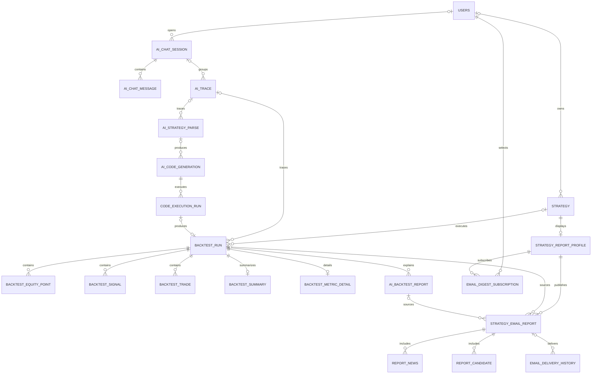

# Service DB ERD

`service_db/migrations`를 번호순으로 적용한 뒤의 핵심 관계를 나타낸다. 실제 컬럼의 기준은 migration SQL이며, 이 문서는 도메인 관계를 빠르게 확인하기 위한 요약이다.

## Migration별 소유 영역

| Migration | 소유 영역 |
| --- | --- |
| `011_app_ai_backtest_erd.sql` | 사용자, 전략, AI 실행·로그, 백테스트, AI 리포트 |
| `013_ai_runtime_logging.sql` | 모델 호출과 agent 실행 연결, 응답 메타데이터, prompt retention 인덱스 |
| `014_create_report_email_tables.sql` | 이메일 리포트, 뉴스, 후보 종목, 구독, 발송 이력, 조회 view |

## 핵심 추적 관계

`app.backtest_run`은 AI 실행 흐름을 추적하기 위해 다음 식별자를 선택적으로 보관한다.

- `session_id`
- `source_parse_id`
- `code_id`
- `execution_run_id`
- `trace_id`

`app.strategy_email_report`는 리포트 생성 근거를 추적하기 위해 다음 식별자를 선택적으로 보관한다.

- `backtest_run_id`
- `ai_report_id`

두 식별자가 없어도 수동 또는 다른 파이프라인에서 생성된 리포트를 저장할 수 있도록 nullable로 유지한다. `performance_jsonb`는 원본 테이블의 최신값이 아니라 발송 당시 화면을 재현하기 위한 snapshot이다.

## 스키마 소유권

- `app.*`: `service_db/migrations`
- `meta/raw/core/feature/mart.*`: `DE/migrations`

교차 FK나 DE view를 직접 참조하는 service_db view가 추가되면, 해당 migration 문서에 필요한 전역 적용 순서를 명시한다.
